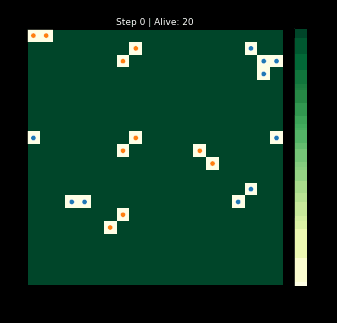
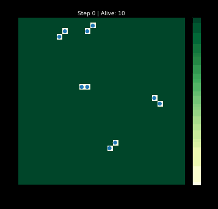
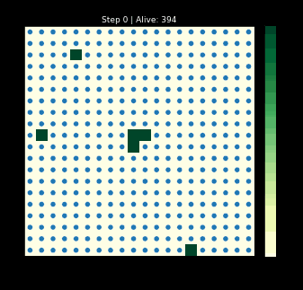
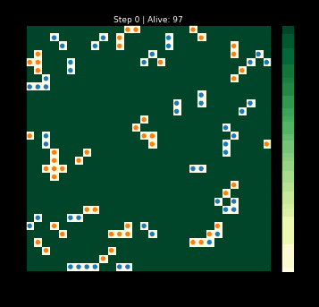

> _Scaffold — prose/interpretation to be filled in. Headings follow the order of
> discovery; charts and GIFs below are seeded from the real benchmark run._

`blobsim` is a small agent-based simulation: "blobs" move, eat, reproduce, and die
on a grid, with **energy strictly conserved** (every joule a blob spends goes to
the environment or to dissipation — none is created). The project's point isn't the
blobs themselves but a discipline: predict aggregate behavior *analytically from
the rules first*, then check the simulation reproduces it.

<!-- TODO: motivation — why build this, what question it answers. -->

```{python}
#| label: setup
import sys
sys.path.insert(0, "analysis")   # dev-only data (gitignored)
import json
import pandas as pd
import plotly.io as pio
import plotly.express as px
import plotly.graph_objects as go
pio.templates.default = "plotly"

import blobsim   # installed from the gol repo wheel
```

## 1. The simulation, in motion

Each blob senses neighbors, picks an action (move / eat / reproduce / idle), and
pays an energy cost. Watch one species deplete a finite grid and go extinct:



<!-- TODO: describe the rule set — sensing, actions, costs, reproduction. -->

A live run, generated in-browser-free by importing the package directly:

```{python}
#| label: live-sim
from blobsim import (
    Simulation, SimulationConfig, SpeciesConfig, BlobAttributes,
    RegeneratingEnvironment, ActionType, SensingLevel, MOORE,
)
from blobsim.species import GrazerRules

attrs = BlobAttributes.create(
    species="grazer", max_energy=10.0, offspring_energy=3.0,
    reproduction_threshold=7.0, base_metabolic_cost=0.1, move_cost=0.2,
    reproduce_cost=0.5, observation_radius=1, sensing_level=SensingLevel.BASIC,
    allowed_actions=frozenset(ActionType), allowed_directions=MOORE,
)
config = SimulationConfig(
    grid_size=30,
    environment=RegeneratingEnvironment(rate=0.05, capacity=2.0, initial_cell_energy=1.0),
    species=[SpeciesConfig(rules_factory=GrazerRules, attributes=attrs, count=25, initial_energy=5.0)],
    seed=42,
)
sim = Simulation(config)
traj = pd.DataFrame([
    {"step": s.step, "population": s.n_alive, "total_energy": s.e_blobs + s.e_grid}
    for s in sim.iterate(steps=200)
])

fig = go.Figure()
fig.add_scatter(x=traj.step, y=traj.population, name="population", yaxis="y1")
fig.add_scatter(x=traj.step, y=traj.total_energy, name="total energy (blobs+grid)", yaxis="y2")
fig.update_layout(
    height=380, margin=dict(l=0, r=0, t=10, b=0),
    xaxis_title="step",
    yaxis=dict(title="population"),
    yaxis2=dict(title="energy", overlaying="y", side="right", showgrid=False),
    legend=dict(orientation="h", y=1.12),
)
fig
```

<!-- TODO: read off the population dynamics — growth, equilibrium / oscillation. -->

## 2. Validating it: prediction vs. observation

Every benchmark computes a target *from the model's rules* (a conservation law, an
expected lifespan, a carrying capacity) and fails if the simulation deviates. The
suite as last run:

```{python}
#| label: bench-table
res = json.load(open("analysis/blobsim/benchmark_results.json"))
df = pd.DataFrame(res["results"])
df[["id", "predicted", "observed_mean", "tolerance", "passed"]]
```

```{python}
#| label: bench-chart
num = df.dropna(subset=["predicted", "observed_mean"])
fig = go.Figure()
fig.add_bar(x=num.id, y=num.predicted, name="predicted")
fig.add_bar(x=num.id, y=num.observed_mean, name="observed")
fig.update_layout(barmode="group", height=340, margin=dict(l=0, r=0, t=10, b=0),
                  legend=dict(orientation="h", y=1.15), yaxis_title="value")
fig
```

<!-- TODO: comment on the agreement; note where observed sits vs prediction. -->

## 3. Calibration — single-blob lifespan (B2a)

A two-phase analytical model predicts mean lifespan E[τ] ≈ 186 steps; the run
observed 185.9.

<!-- TODO: the two-phase argument (stochastic phase → deterministic idle → death). -->

## 4. Convergence — population-level laws

### 4.1 Guaranteed extinction (SC-1)

Finite energy ⇒ extinction within a bounded number of steps, conservation holding
at the terminus. *(GIF in §1.)*

<!-- TODO. -->

### 4.2 Boom then bust (SC-4)



<!-- TODO: overshoot → depletion → die-off; why the peak is grid-bound, not energy-bound. -->

### 4.3 Carrying capacity (SC-5)



Analytical N\* ≈ 105.9; sparse and dense starts both converge to ~130 — a steady
**~25% above** prediction.

<!-- TODO: the insight — uniform-mixing overestimates collision waste; real blobs
spread out, so fewer actions fail. -->

### 4.4 Energy steady-state (SC-6)

A single blob on a rich regenerating grid pins to `max_energy` with zero variance.

<!-- TODO. -->

## 5. Species competition



<!-- TODO: competition dynamics / who wins and why. -->

## Insights, in order of discovery

<!-- TODO: ordered list of the main takeaways, e.g.
1. Conservation is the backbone — every benchmark is ultimately an energy-accounting check.
2. Extinction is guaranteed under decay regardless of reproduction (redistribution ≠ creation).
3. Peaks are grid-bound before they are energy-bound at high density.
4. The uniform-mixing model systematically over-penalizes collisions (~25% low on N*).
-->
